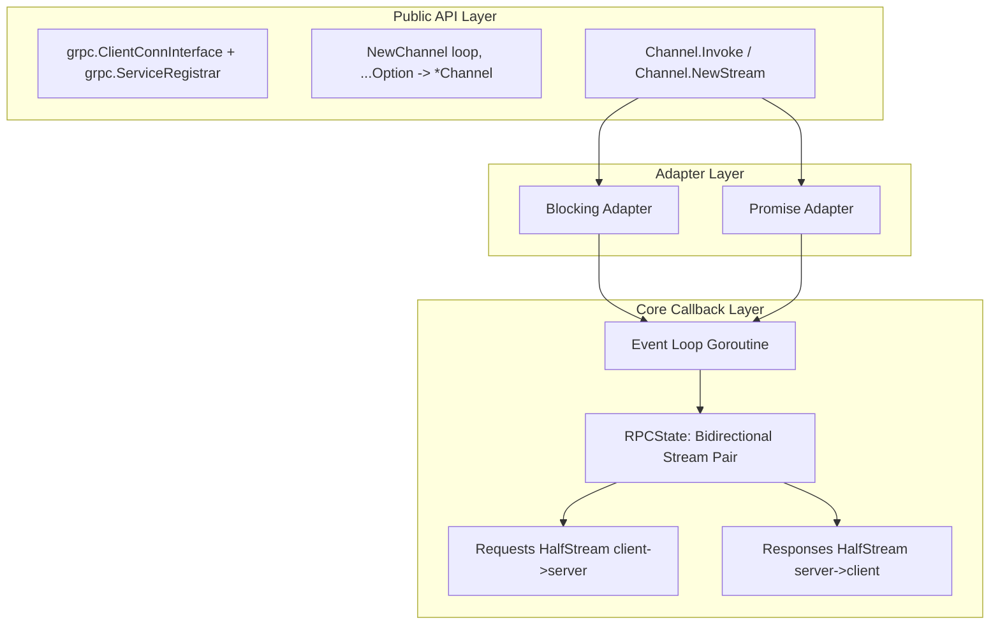
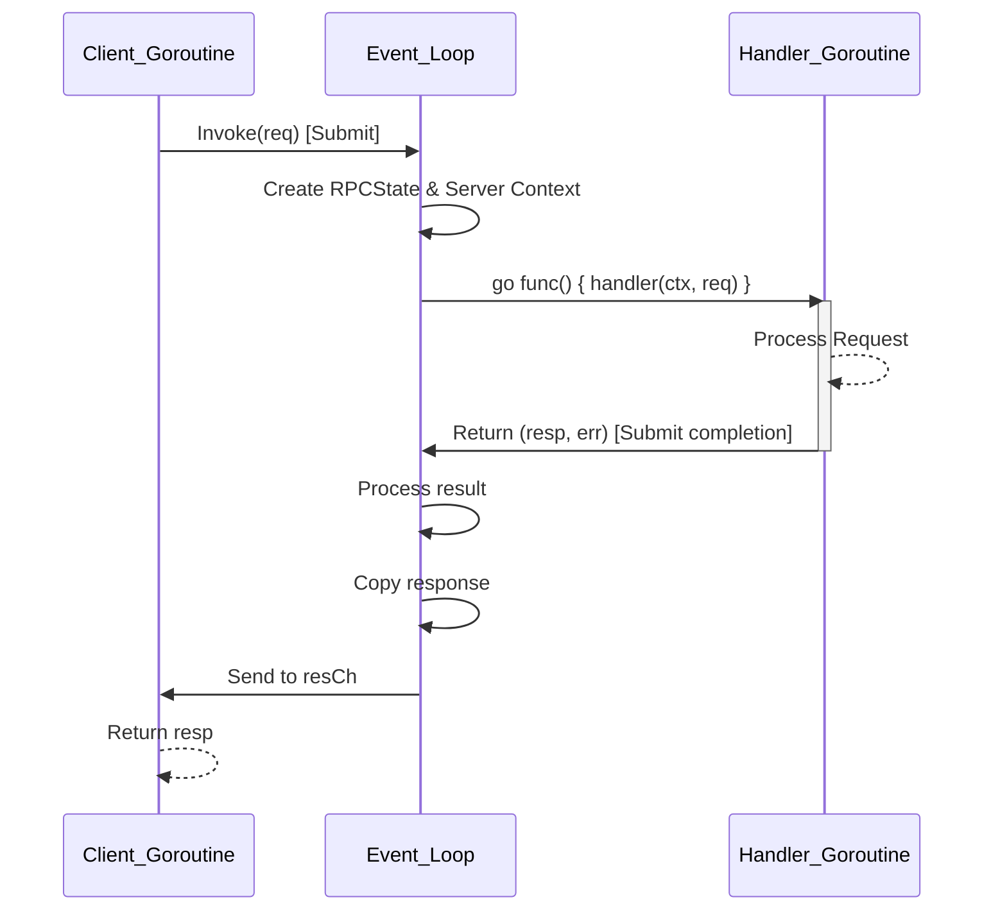
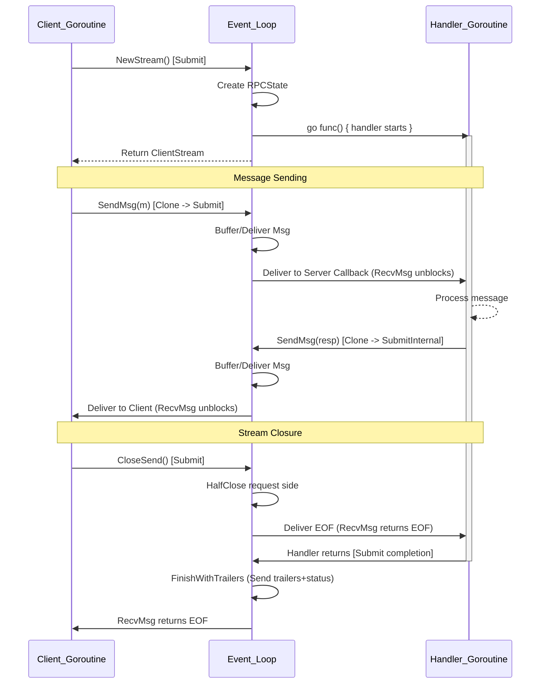

# Design Document: go-inprocgrpc

## 1. Overview

`go-inprocgrpc` provides an in-process gRPC channel where RPCs amount to direct function calls. This eliminates network I/O, HTTP/2 framing, and protobuf serialization overhead while maintaining full gRPC semantics. The `Channel` type serves as both `grpc.ClientConnInterface` (client side) and `grpc.ServiceRegistrar` (server side), meaning a single `Channel` instance can have services registered on it and be used directly as a client connection without a separate server process or dial.

## 2. Architecture

### Event-Loop-Driven Design (Reactor Pattern)

All stream state and message delivery is managed by an `eventloop.Loop`. The event loop acts as the synchronization backbone, owning all stream state and coordinating message delivery. Handler goroutines use blocking adapters wrapping a callback-based stream core, while completion is submitted back to the loop for thread safety.

#### Rationale: Why Event-Loop?

A naïve approach spawns a goroutine per RPC and uses Go channels for frame passing. However, `go-inprocgrpc` is event-loop native to facilitate eventloop-native integrations, specifically performant interop with VMs like Goja. While these VMs share Go-native data structures, they suffer from an impedance mismatch between Goroutines and a logically single-threaded execution model.

By centralizing state on the reactor-style event loop, this architecture enables highly-performant aggregation and specialized implementations-such as combining this mechanism with existing gRPC proxy implementations to expose external gRPC APIs within VMs-without the overhead of context switching or channel locking for every message.

### Layered Design

The architecture consists of three distinct layers ensuring separation between the public API, the execution model adapters, and the thread-safe core.

#### Layer 1: Core Callback Layer (`internal/stream`)

All stream state lives on the event loop goroutine. An `RPCState` holds two `HalfStream` objects (Requests for client→server, Responses for server→client), plus metadata (ResponseHeaders, ResponseTrailers, Method).

Each `HalfStream`:

* Buffers messages in a FIFO queue when no receiver is ready.
* Delivers messages directly via a registered one-shot callback when a receiver is waiting.
* Tracks a binary state: open or closed (with optional error on close).
* Is re-entrant safe - callbacks may call Send/Close during delivery.

**No mutexes** are used; all mutations happen on the loop goroutine via `Loop.SubmitInternal`.

#### Layer 2: Blocking Adapter (Go Handlers)

Standard gRPC `ServerStream`/`ClientStream` interfaces require blocking `RecvMsg`/`SendMsg`. Thin blocking adapters wrap the callback core using buffered channels and event-loop `Submit`.

* **RecvMsg**: Registers a "wake me" callback on the loop via the core `Recv(cb)` method and blocks on a channel. When the loop delivers a message via callback, it sends to the channel, unblocking the goroutine.
* **SendMsg**: Submits a "send this message" task to the loop via `SubmitInternal`. Blocks until the loop acknowledges (message cloned and buffered/delivered).

#### Layer 3: Promise Adapter (Extensibility/JS)

This layer bypasses interceptors and stats handlers, providing a minimal, high-performance entry point for integration with JS runtimes (Goja) or other non-blocking execution models.

* **Implementation**: Wraps the callback core with `ChainedPromise`-based send/receive.
* **Behavior**: `stream.recv()` returns a Promise resolved by the callback.
* **Execution**: Zero goroutines are spawned; all handler code runs directly on the event loop.

### Message Isolation

Because client and server share address space, messages must be cloned to prevent concurrent mutation. The `Cloner` interface provides two methods:

* `Clone(any) (any, error)` - deep copy for streaming sends.
* `Copy(out, in any) error` - in-place copy for unary and recv.

The default `ProtoCloner` uses `proto.Clone` and `proto.Merge`. For non-proto types, it falls back to the registered gRPC proto codec.

### Context Isolation

Server handlers receive a context that acts as a firewall preventing state leakage while preserving control flow. This context:

1. Inherits cancellation and deadline from the client.
2. Blocks access to client-side context values via `noValuesContext`.
3. Converts outgoing metadata to incoming metadata.
4. Sets peer info to `inproc:0`.
5. Stores the original client context (retrievable via `ClientContext`).

## 3. Message Flow

### Unary RPC

### Streaming RPC

## 4. Implementation Details

### Channel

Create instances with `NewChannel(opts...)`. The loop must be provided via `WithLoop` option. The zero value is not usable. Configuration uses functional `Option` values applied during construction.

### Handler Map

Services are stored in a `handlerMap` protected by `sync.RWMutex`. The map stores `grpc.ServiceDesc` and handler implementation pairs, keyed by service name. Handler type validation uses `reflect` to verify the implementation satisfies the `ServiceDesc.HandlerType` interface at registration time, matching the behavior of `grpc.Server.RegisterService`.

### Stats Handler Integration

Both client and server stats handlers are supported. The stats lifecycle follows the standard gRPC pattern: `TagRPC → Begin → OutPayload/InPayload → InHeader/InTrailer → End`. The `statsHandlerHelper` type provides nil-safe convenience methods that mirror the `stats.Handler` interface.

### Error Translation

Server-returned context errors (`context.Canceled`, `context.DeadlineExceeded`) are translated to proper gRPC status errors via `internal/grpcutil.TranslateContextError`, ensuring clients always receive `status.Status`-compatible errors.

## 5. Design Decisions

1. **Event-loop-driven**: All stream state and message delivery is managed by the event loop. Handler goroutines use blocking adapters wrapping the callback-based core.
2. **Panic on invariant violations**: Following `grpc.Server` convention, `RegisterService` panics for duplicate registrations and handler type mismatches. `NewChannel` panics if the loop parameter is nil (a programming error). Option validation errors are returned normally.
3. **Functional options for configuration**: `NewChannel(opts...)` accepts `Option` values. The loop must be provided via `WithLoop`. Options are applied during construction and are not modifiable afterward.
4. **Callback-based stream core**: The internal stream uses direct callback delivery on the event loop goroutine, avoiding goroutine and channel overhead. Blocking adapters wrap this for Go handler goroutines.

## 6. Internal Packages

The `internal/` directory contains sub-packages shared between the channel and stream implementations but not part of the public API:

* `callopts` - gRPC call option processing
* `grpcutil` - context error translation, method lookup
* `transport` - transport stream implementations
* `stream` - callback-based stream core (HalfStream, RPCState)
