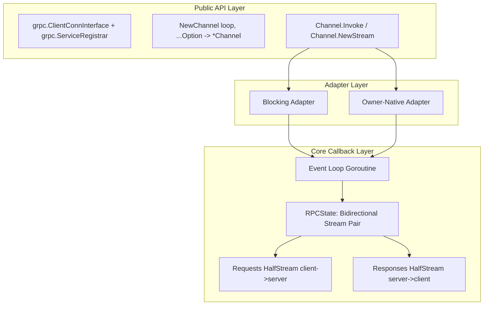
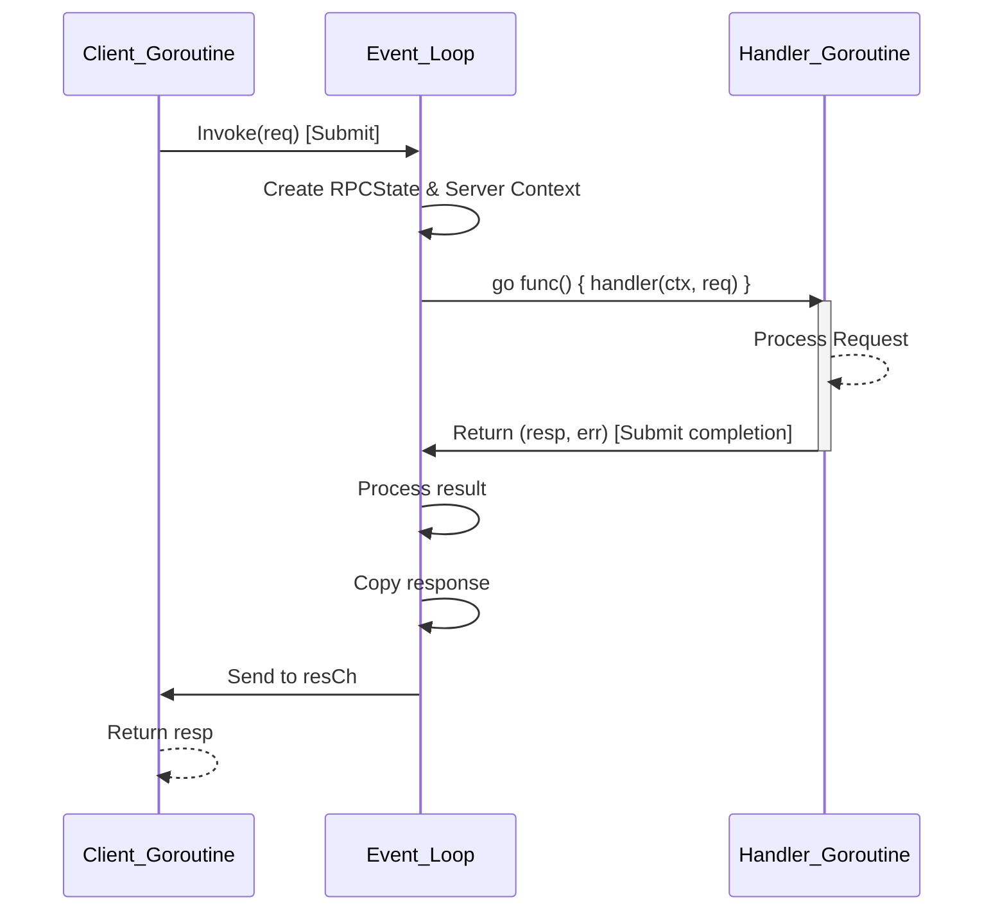
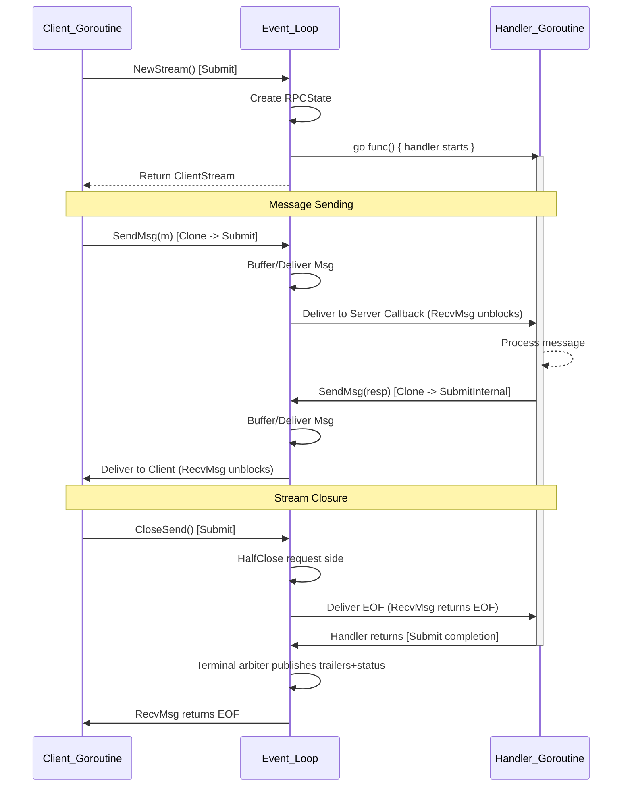

# Design Document: go-inprocgrpc

## 1. Overview

`go-inprocgrpc` provides an in-process gRPC channel where RPCs amount to
direct function calls. This eliminates network I/O, HTTP/2 framing, and
protobuf serialization overhead. The supported profile includes gRPC client
and service registration interfaces, streaming, metadata, status, contexts,
stats, and server interceptors; it does not claim wire-transport parity. The
`Channel` type serves as both `grpc.ClientConnInterface` (client side) and
`grpc.ServiceRegistrar` (server side), so a single instance can register
services and act as a client connection without a server process or dial.

## 2. Architecture

### Event-Loop-Driven Design (Reactor Pattern)

Ordinary stream data, metadata, and callback delivery is managed by an
`eventloop.Loop`. The event loop acts as the synchronization backbone for the
stream core. A small synchronized arbiter accepts terminal claims from handler,
client, cancellation, and scheduler goroutines; publication still occurs on
the owner when it remains available.

#### Rationale: Why Event-Loop?

A naïve approach spawns a goroutine per RPC and uses Go channels for frame passing. However, `go-inprocgrpc` is event-loop native to facilitate eventloop-native integrations, specifically performant interop with VMs like Goja. While these VMs share Go-native data structures, they suffer from an impedance mismatch between Goroutines and a logically single-threaded execution model.

By centralizing state on the reactor-style event loop, this architecture enables highly-performant aggregation and specialized implementations-such as combining this mechanism with existing gRPC proxy implementations to expose external gRPC APIs within VMs-without the overhead of context switching or channel locking for every message.

### Layered Design

The architecture consists of three distinct layers ensuring separation between the public API, the execution model adapters, and the owner-confined core.

```mermaid
graph TD
    subgraph Public_API_Layer ["Public API Layer"]
        A["grpc.ClientConnInterface + grpc.ServiceRegistrar"]
        B["NewChannel loop, ...Option -> *Channel"]
        C["Channel.Invoke / Channel.NewStream"]
    end

    subgraph Adapter_Layer ["Adapter Layer"]
        D["Blocking Adapter"]
        E["Owner-Native Adapter"]
    end

    subgraph Core_Layer ["Core Callback Layer"]
        F["Event Loop Goroutine"]
        G["RPCState: Bidirectional Stream Pair"]
        H["Requests HalfStream client->server"]
        I["Responses HalfStream server->client"]
    end

    C --> D
    C --> E
    D --> F
    E --> F
    F --> G
    G --> H
    G --> I

```

#### Layer 1: Core Callback Layer (`internal/stream`)

Ordinary `RPCState` access lives on the event loop goroutine. An `RPCState`
holds two `HalfStream` objects (Requests for client→server, Responses for
server→client), plus metadata (ResponseHeaders, ResponseTrailers, Method).
After the event loop's terminal `Done` proves that owner callbacks cannot run
again, the lifecycle recovery path takes exclusive ownership of this state.
It may preserve accepted buffered responses and transferred prepared unary
material for client draining while releasing inaccessible requests and
waiters.

Each `HalfStream`:

* Buffers messages in a finite FIFO queue when no receiver is ready.
* Delivers messages directly via a registered one-shot callback when a receiver is waiting.
* Gives blocking adapters one pending producer slot when queue credit is
  exhausted; callback senders remain non-blocking and receive
  `ResourceExhausted`.
* Distinguishes graceful close, which preserves accepted messages for receiver
  draining, from abort, which releases buffered messages, waiters, and
  producers immediately.
* Is re-entrant safe - callbacks may call Send/Close during delivery.

Owner-confined `HalfStream` queue mutation uses no mutex and runs on the loop
goroutine. Tracked adapter operations reserve owner, delivery, and stats
identities through a separate synchronized lifecycle arbiter. Off-owner
recovery is permitted only after `Done` establishes exclusive access.

#### Layer 2: Blocking Adapter (Go Handlers)

Standard gRPC `ServerStream`/`ClientStream` interfaces require blocking `RecvMsg`/`SendMsg`. Thin blocking adapters wrap the callback core using buffered channels and event-loop `Submit`.

* **RecvMsg**: Registers a "wake me" callback on the loop via the core `Recv(cb)` method and blocks on a channel. When the loop delivers a message via callback, it sends to the channel, unblocking the goroutine.
* **SendMsg**: Submits a "send this message" task to the loop via `SubmitInternal`. Blocks until the loop grants finite queue credit and acknowledges the isolated message.

#### Layer 3: Owner-Native Adapter (Extensibility)

This layer bypasses interceptors and stats handlers, providing a minimal,
non-blocking entry point for integrations that already execute on the event-loop
owner.

* **Implementation**: `RPCStream` exposes one-shot receive callbacks and bounded,
  non-blocking sends.
* **Behavior**: Integrations translate owner-only data callbacks into the
  policy appropriate for their runtime. `RPCStream.Abort` is the deliberate
  any-goroutine terminal exception.
* **Execution**: Handler code runs directly on the event loop and must not
  block.

### Message Isolation

Because client and server share address space, messages must be cloned to prevent concurrent mutation. The `Cloner` interface provides two methods:

* `Clone(any) (any, error)` - deep copy for streaming sends.
* `Copy(out, in any) error` - in-place copy for unary and recv.

The default `ProtoCloner` uses `proto.Clone` and `proto.Merge`. For non-proto types, it falls back to the registered gRPC proto codec.

### Context Isolation

Server handlers receive a context that acts as a firewall preventing state leakage while preserving control flow. This context:

1. Inherits cancellation and deadline from the client.
2. Blocks access to client-side context values via `noValuesContext`.
3. Converts outgoing metadata to incoming metadata.
4. Sets peer info to `inproc:0`.
5. Stores the original client context (retrievable via `ClientContext`).

## 3. Message Flow

### Unary RPC

```mermaid
sequenceDiagram
    participant Client as Client_Goroutine
    participant EventLoop as Event_Loop
    participant Handler as Handler_Goroutine
    Client ->> EventLoop: Invoke(req) [Submit]
    EventLoop ->> EventLoop: Create RPCState & Server Context
    EventLoop ->> Handler: go func() { handler(ctx, req) }
    activate Handler
    Handler -->> Handler: Process Request
    Handler ->> EventLoop: Return (resp, err) [Submit completion]
    deactivate Handler
    EventLoop ->> EventLoop: Process result
    EventLoop ->> EventLoop: Copy response
    EventLoop ->> Client: Send to resCh
    Client -->> Client: Return resp

```

### Streaming RPC

```mermaid
sequenceDiagram
    participant Client as Client_Goroutine
    participant EventLoop as Event_Loop
    participant Handler as Handler_Goroutine
    Client ->> EventLoop: NewStream() [Submit]
    EventLoop ->> EventLoop: Create RPCState
    EventLoop ->> Handler: go func() { handler starts }
    activate Handler
    EventLoop -->> Client: Return ClientStream
    Note over Client, Handler: Message Sending
    Client ->> EventLoop: SendMsg(m) [Clone -> Submit]
    EventLoop ->> EventLoop: Buffer/Deliver Msg
    EventLoop ->> Handler: Deliver to Server Callback (RecvMsg unblocks)
    Handler -->> Handler: Process message
    Handler ->> EventLoop: SendMsg(resp) [Clone -> SubmitInternal]
    EventLoop ->> EventLoop: Buffer/Deliver Msg
    EventLoop ->> Client: Deliver to Client (RecvMsg unblocks)
    Note over Client, Handler: Stream Closure
    Client ->> EventLoop: CloseSend() [Submit]
    EventLoop ->> EventLoop: HalfClose request side
    EventLoop ->> Handler: Deliver EOF (RecvMsg returns EOF)
    Handler ->> EventLoop: Handler returns [Submit completion]
    deactivate Handler
    EventLoop ->> EventLoop: Terminal arbiter publishes trailers+status
    EventLoop ->> Client: RecvMsg returns EOF

```

## 4. Implementation Details

### Channel

Create instances with `NewChannel(opts...)`. The loop must be provided via
`WithLoop`; it must expose a stable terminal `Done` signal that closes only
after admitted callbacks can no longer execute. Its `Submit` and
`SubmitInternal` owner scopes must contain panic and `runtime.Goexit` (or
replace the physical owner while preserving logical ownership), so an abnormal
accepted callback cannot prevent later accepted work. The zero value is not
usable.
Each `With*` constructor returns a dedicated option type. `WithStreamBuffer`
sets the finite per-direction message capacity.

### RPC Lifecycle

Each RPC owns one first-terminal-wins arbiter shared by cancellation, deadlines,
handler completion, abnormal exits, cardinality failures, and scheduler
termination. The winner is normally published on the loop owner. If the owner
is lost, the event loop's `Done` signal permits exclusive recovery. Recovery
folds a transferred prepared unary result exactly once, preserves accepted
buffered responses for client draining, and releases inaccessible requests
and waiters without invoking callbacks off-owner. The stable terminal
observation publishes the immutable first winner independently of the RPC's
full `Done`, which also waits for accepted deliveries, stats acknowledgements,
and client/server finalization. Successful completion preserves accepted
responses for draining; abort clears both directions immediately.

### Handler Map

Services are stored in a `handlerMap` protected by `sync.RWMutex`. The map stores `grpc.ServiceDesc` and handler implementation pairs, keyed by service name. Handler type validation uses `reflect` to verify the implementation satisfies the `ServiceDesc.HandlerType` interface at registration time, matching the behavior of `grpc.Server.RegisterService`.

### Stats Handler Integration

Both client and server stats handlers are supported. Metadata and payload
events are emitted only when the corresponding value is actually published or
received. Consequently trailers-only errors omit header events, while local
preparation failures and scheduler loss do not invent inbound or outbound
metadata. `End` is last; headers, trailers, and terminal events are each
emitted at most once. Owner-native callback handlers deliberately bypass stats
handlers.

### Error Translation

Server-returned context errors, including wrapped `context.Canceled` and
`context.DeadlineExceeded`, are translated to proper gRPC status errors.
Ordinary handler errors become `Unknown`; panics and `runtime.Goexit` become
`Internal`.

## 5. Design Decisions

1. **Event-loop-driven**: Ordinary stream state and message delivery is owned
   by the event loop. Handler goroutines use blocking adapters around the
   callback core, while synchronized terminal admission and post-`Done`
   recovery cover owner loss.
2. **Panic on construction and registration invariants**: Following
   `grpc.Server` convention, invalid channel options, duplicate registrations,
   and handler type mismatches panic before serving.
3. **Typed options for configuration**: `NewChannel(opts...)` accepts `Option`
   values returned by dedicated `With*` constructors. Options are immutable
   after construction.
4. **Callback-based stream core**: The internal stream uses direct callback delivery on the event loop goroutine, avoiding goroutine and channel overhead. Blocking adapters wrap this for Go handler goroutines.

## 6. Internal Packages

The `internal/` directory contains sub-packages shared between the channel and stream implementations but not part of the public API:

* `callopts` - gRPC call option processing
* `grpcutil` - context error translation, method lookup
* `transport` - transport stream implementations
* `stream` - callback-based stream core (HalfStream, RPCState)
