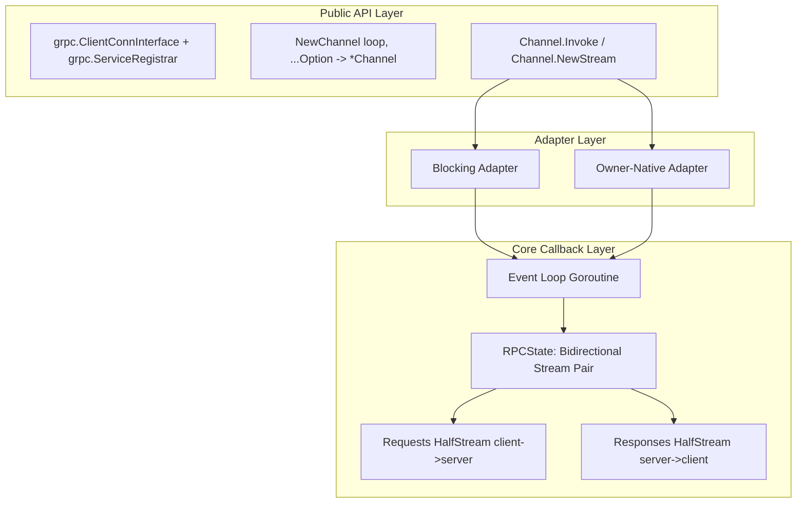
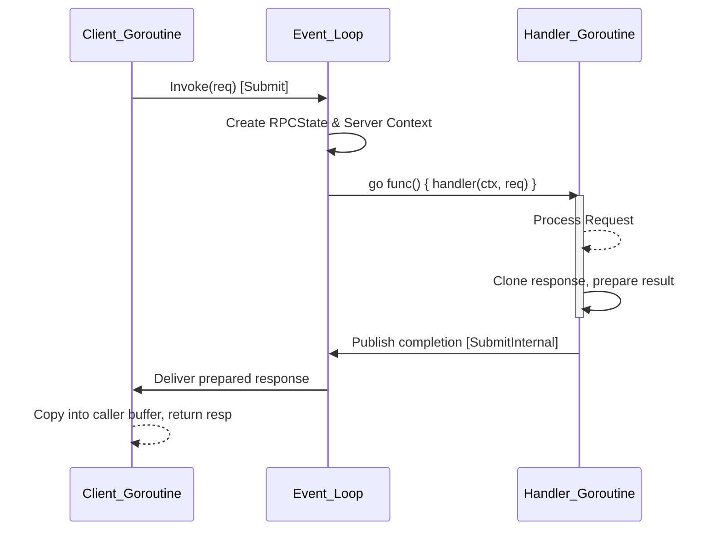
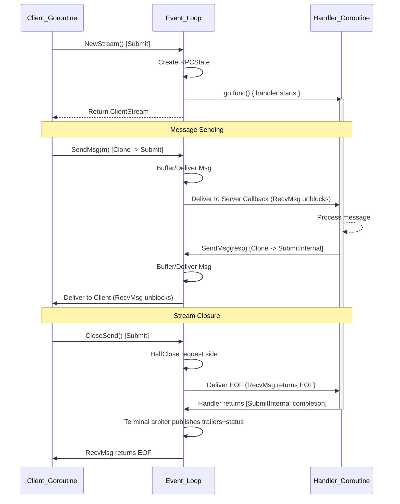

# Design Document: go-inprocgrpc

## 1. Overview

`go-inprocgrpc` is an in-process gRPC channel. An RPC is a direct function
call: there is no network I/O, no HTTP/2 framing, and no protobuf wire
serialization. The supported surface covers the gRPC client and service
registration interfaces, streaming, metadata, status codes, contexts, stats
handlers, and server interceptors. It does not provide wire transport. One
`Channel` value implements both
`grpc.ClientConnInterface` and `grpc.ServiceRegistrar`, so a single instance
can register services and act as its own client connection.

## 2. Architecture

### Event-Loop Core

An `eventloop.Loop` owns ordinary stream data, metadata, and callback
delivery. A separate, small synchronized arbiter takes terminal claims from
handler, client, cancellation, and scheduler goroutines; the winning terminal
is published on the loop owner whenever the owner still exists.

#### Why an Event Loop?

The obvious alternative is one goroutine per RPC with Go channels carrying
messages. That works for plain Go callers, but it fits virtual machines like
Goja badly: the VM executes on one logical thread, so every message handed to
a goroutine crosses between execution models.

Centralizing state on one event loop removes that boundary crossing. Message
handoff becomes a function call on the loop goroutine instead of a channel
operation, which makes integrations such as running a gRPC proxy inside a VM
practical without per-message locking or goroutine switches.

### Layers

The code splits into three layers: the public API, the execution-model
adapters, and the callback core confined to the loop owner.

```mermaid
graph TD
    subgraph Public_API_Layer ["Public API Layer"]
        A["grpc.ClientConnInterface + grpc.ServiceRegistrar"]
        B["NewChannel loop, ...Option -> *Channel"]
        C["Channel.Invoke / Channel.NewStream"]
    end

    subgraph Adapter_Layer ["Adapter Layer"]
        D["Blocking Adapter"]
        E["Owner-Native Adapter"]
    end

    subgraph Core_Layer ["Core Callback Layer"]
        F["Event Loop Goroutine"]
        G["RPCState: Bidirectional Stream Pair"]
        H["Requests HalfStream client->server"]
        I["Responses HalfStream server->client"]
    end

    C --> D
    C --> E
    D --> F
    E --> F
    F --> G
    G --> H
    G --> I

```

#### Layer 1: Callback Core (`internal/stream`)

An `RPCState` holds two `HalfStream` values (Requests for client→server,
Responses for server→client) plus response headers, trailers, and the method
name. All ordinary access happens on the loop goroutine with no mutexes.
After the loop's terminal `Done` signal proves that admitted callbacks can no
longer execute, recovery takes exclusive ownership of the state. It can keep
accepted buffered responses and any prepared unary result so the client can
still drain them, and it releases unreachable requests and waiters without
running callbacks off the owner.

Each `HalfStream`:

* buffers messages in a finite FIFO queue when no receiver is waiting,
* delivers directly through a registered one-shot callback when a receiver
  is already waiting,
* gives blocking senders one pending producer slot when the queue is full;
  non-blocking (callback) senders instead get `ResourceExhausted`
  immediately,
* treats graceful close and abort differently: close keeps buffered messages
  available for draining, abort discards buffered messages and fails waiters
  and the pending producer right away,
* allows callbacks to call Send and Close while a delivery is in progress.

Tracked adapter operations reserve owner, delivery, and stats identities
through a second synchronized lifecycle arbiter. Off-owner recovery runs only
after `Done` establishes exclusive access.

#### Layer 2: Blocking Adapter (Go Handlers)

Standard gRPC `ServerStream` and `ClientStream` implementations block in
`RecvMsg` and `SendMsg`. Thin wrappers provide that around the callback core:

* **RecvMsg** registers a one-shot receive callback through the core
  `Recv(cb)` method, then blocks on a channel. The loop delivers the next
  message through the callback, which sends it over the channel and wakes the
  goroutine.
* **SendMsg** submits a task to the loop owner and blocks until the core
  accepts the message, either immediately or once queue credit frees up.
  Caller sends enter through `Submit`; handler-side sends (and terminal
  publication) enter through `SubmitInternal`.

#### Layer 3: Owner-Native Adapter (`RPCStream`)

Integrations that already run on the loop owner can skip the blocking layer,
and with it interceptors and stats handlers. `RPCStream` exposes one-shot
receive callbacks and bounded non-blocking sends. Most methods must be called
on the loop goroutine. The exceptions are `Abort`, which is nonblocking and
safe from any goroutine, and the observation methods `Done` and
`TerminalResult`, which are also safe from any goroutine.
`ScheduleCallback` may be called from any goroutine because it enters through
the loop's external submission path. Handlers run on the loop and must not
block.

### Message Isolation

Client and server share one address space, so every message crossing the
boundary is copied. The `Cloner` interface has two methods:

* `Clone(any) (any, error)`: deep copy used when sending.
* `Copy(out, in any) error`: in-place copy used for unary responses and
  receives.

The default `ProtoCloner` uses `proto.Clone` and `proto.Merge`. For values
that are not proto messages it falls back to the registered gRPC `proto`
codec.

### Server Context Isolation

Handlers never see the caller's context values. `makeServerContext` builds
the handler context by wrapping the client context so that:

1. cancellation and deadline carry over,
2. `Value` lookups return nil (values do not leak),
3. outgoing client metadata becomes incoming server metadata (cloned),
4. peer information reports `inproc:0`,
5. the original client context stays reachable through `ClientContext`.

## 3. Message Flow

### Unary RPC

```mermaid
sequenceDiagram
    participant Client as Client_Goroutine
    participant EventLoop as Event_Loop
    participant Handler as Handler_Goroutine
    Client ->> EventLoop: Invoke(req) [Submit]
    EventLoop ->> EventLoop: Create RPCState & Server Context
    EventLoop ->> Handler: go func() { handler(ctx, req) }
    activate Handler
    Handler -->> Handler: Process Request
    Handler ->> Handler: Clone response, prepare result
    deactivate Handler
    Handler ->> EventLoop: Publish completion [SubmitInternal]
    EventLoop ->> Client: Deliver prepared response
    Client -->> Client: Copy into caller buffer, return resp

```

### Streaming RPC

```mermaid
sequenceDiagram
    participant Client as Client_Goroutine
    participant EventLoop as Event_Loop
    participant Handler as Handler_Goroutine
    Client ->> EventLoop: NewStream() [Submit]
    EventLoop ->> EventLoop: Create RPCState
    EventLoop ->> Handler: go func() { handler starts }
    activate Handler
    EventLoop -->> Client: Return ClientStream
    Note over Client, Handler: Message Sending
    Client ->> EventLoop: SendMsg(m) [Clone -> Submit]
    EventLoop ->> EventLoop: Buffer/Deliver Msg
    EventLoop ->> Handler: Deliver to Server Callback (RecvMsg unblocks)
    Handler -->> Handler: Process message
    Handler ->> EventLoop: SendMsg(resp) [Clone -> SubmitInternal]
    EventLoop ->> EventLoop: Buffer/Deliver Msg
    EventLoop ->> Client: Deliver to Client (RecvMsg unblocks)
    Note over Client, Handler: Stream Closure
    Client ->> EventLoop: CloseSend() [Submit]
    EventLoop ->> EventLoop: HalfClose request side
    EventLoop ->> Handler: Deliver EOF (RecvMsg returns EOF)
    Handler ->> EventLoop: Handler returns [SubmitInternal completion]
    deactivate Handler
    EventLoop ->> EventLoop: Terminal arbiter publishes trailers+status
    EventLoop ->> Client: RecvMsg returns EOF

```

## 4. Implementation Details

### Channel

Create instances with `NewChannel(opts...)`. The loop must be provided via
`WithLoop`; it must expose a stable terminal `Done` signal that closes only
after admitted callbacks can no longer execute. Its `Submit` and
`SubmitInternal` owner scopes must contain panic and `runtime.Goexit` (or
replace the physical owner while preserving logical ownership), so an abnormal
accepted callback cannot prevent later accepted work. The zero value is not
usable.
Each `With*` constructor returns a dedicated option type. `WithStreamBuffer`
sets the finite per-direction message capacity.

### RPC Lifecycle

Each RPC owns one first-terminal-wins arbiter shared by cancellation, deadlines,
handler completion, abnormal exits, cardinality failures, and scheduler
termination. The winner is normally published on the loop owner. If the owner
is lost, the event loop's `Done` signal permits exclusive recovery. Recovery
folds a transferred prepared unary result exactly once, preserves accepted
buffered responses for client draining, and releases inaccessible requests
and waiters without invoking callbacks off-owner. The stable terminal
observation publishes the immutable first winner independently of the RPC's
full `Done`, which also waits for accepted deliveries, stats acknowledgements,
and client/server finalization. Successful completion preserves accepted
responses for draining; abort clears both directions immediately.

### Handler Map

Services live in a `handlerMap` guarded by a `sync.RWMutex`, keyed by service
name and holding `grpc.ServiceDesc` plus the implementation. At registration
time the map checks with `reflect` that the implementation satisfies the
descriptor's `HandlerType`, matching what `grpc.Server.RegisterService`
does.

### Stats Handler Integration

Both client and server stats handlers are supported. Header, payload, and
trailer events fire only when the corresponding value is actually published
or received, so a trailers-only error produces no header events, and local
preparation failures or scheduler loss produce no invented metadata. `End`
comes last. Headers, trailers, and terminal events are each reported at most
once. Owner-native callback handlers deliberately bypass stats handlers.

### Error Translation

Server-returned context errors translate to their gRPC statuses; the check
uses `errors.Is`, so wrapped `context.Canceled` and
`context.DeadlineExceeded` values are covered too. Any other handler error
becomes `Unknown`. Panics and `runtime.Goexit` become `Internal`.

## 5. Design Decisions

1. **Event-loop-driven**: Ordinary stream state and message delivery is owned
   by the event loop. Handler goroutines use blocking adapters around the
   callback core, while synchronized terminal admission and post-`Done`
   recovery cover owner loss.
2. **Panic on construction and registration invariants**: Following
   `grpc.Server` convention, invalid channel options, duplicate registrations,
   and handler type mismatches panic before serving.
3. **Typed options for configuration**: `NewChannel(opts...)` accepts `Option`
   values returned by dedicated `With*` constructors. Options are immutable
   after construction.
4. **Callback-based stream core**: The internal stream uses direct callback delivery on the event loop goroutine, avoiding goroutine and channel overhead. Blocking adapters wrap this for Go handler goroutines.

## 6. Internal Packages

The `internal/` directory contains sub-packages shared between the channel
and stream implementations. They are not part of the public API:

* `callopts`: gRPC call option processing
* `grpcutil`: context error translation, method lookup
* `transport`: transport stream implementations
* `stream`: callback-based stream core (HalfStream, RPCState)
